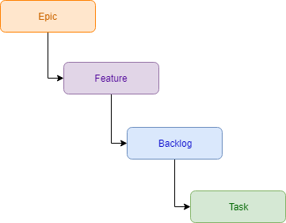

# 2.9 ¿Qué es Scrum?

Antes de empezar a programar es recomendable hacer una planeación de las tareas a realizar y quien las va a realizar. Las metodologías mas comunes actualmente son Agiles o Scrum. En este ejemplo utilizaré Scrum.

Antes de definir tus tareas o la forma de trabajar es importante pensar en quienes serán tus usuarios, que edad tienen, como es que utilizan el sistema, por ejemplo si siempre lo utilizan en un horario fijo en horario de oficina, si no sufren distracciones, o si para realizar una tarea deben comunicarse con otras personas, etc. 

Para nuestro ejemplo los usuarios podrían ser gerentes de farmacias de ciudades medianas y grandes, los cuales tienen una edad entre 30 y 35 años, los cuales deben revisar los productos próximos a caducar para ponerlos en oferta para que no caduquen.

En Scrum tu defines las tareas \(backlogs\) para ir entregando el sistema en tiempos cortos de dos semanas a un mes, con una funcionalidad básica e ir agregando mas funcionalidad en cada iteración \(sprint\), entre mas pronto entregues el software es más fácil realizar mejoras e ir revisando si se cumple con los requisitos y calidad que el cliente espera. Se recomienda ir clasificando tus tareas de forma jerárquica.

Para cada sprint se define las User Stories los cuales son  descripciones de las nuevas funciones que se desea desarrollar durante un sprint. Se debe entregar alguna funcionalidad. 

Por  lo general es lo que el usuario o cliente del sistema desea, describiendo de forma general como trabaja y para que necesita el sistema. Se deben definir los criterios de aceptación que es un checklist de lo que debe cumplir para completar el User Story. 


Una buena user story debe:

* Ser independiente, no debe interferir con otras user stories.
* Entregar algún valor al usuario. 
* Tener un tiempo estimado menor al tiempo del Sprint.
* Definir los criterios de aceptación.


Se revisa con el cliente las prioridades a entregar en cada sprint. Se tienen elementos básicos para clasificar el trabajo.

* **Epic:**  Es una colección de User Stories que pertenecen al mismo módulo o característica para alcanzar una meta. Por ejemplo serían todas las user stories para controlar la caducidad de los productos
* **Features:**  Representa una opción o componente del sistema que se va entregar por ejemplo: Agregar la opción de login, agregar un carrito de compras, etc.
* **Backlogs:** Es una lista de tareas \(user stories\) que necesitan realizarse en el proyecto para alcanzar la meta del producto. Por ejemplo un backlog podría ser el registro de nuevos usuarios
* **Task:** Son las tareas que se necesitan realizar en cada backlog. Para el ejemplo del registro de neuvos usuarios, las tareas podrían ser registro con Facebook, registro con Gmail, registro manual con correo, confirmación de email.

Puedes ver la documentación oficial aquí de momento solo esta en inglés



### Ejemplo de un User Story

Para la aplicación de ejemplo un User Story sería:

Nombre: Servicio para registrar las categorías de los productos

Descrición: Un usuario de tipo Administrador registra las categorías de todos los productos,  de esta manera mas adelante podrá asignar a cada vendedor las categorías de productos que debe vender y cuidar la fecha de caducidad.

Criterio de Aceptación: Debe validar que solo los usuarios de tipo administrador tengan acceso a esta opción en el menú.

Se deben crear, modificar y borrar categorías. 

Si un usuario no es administrador y quiere acceder a la página directamente debe mostrarle un error

Prioridad: 1

Puedes ver los siguientes links en inglés para aprender mas sobre scrum y las buenas prácticas





