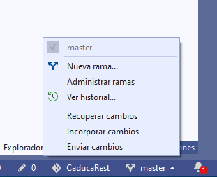

# 3.9.2 Trabajando con ramas con Visual Studio

### Crear una nueva rama en Visual Studio

Para crear ramas con Visual Studio tienes 2 opciones:

#### Opción 1:

1. Da clic en la rama que se encuentra en la parte inferior. Se muestran las opciones para trabajar con la rama, como crear una rama, o Administrar ramas para ver las ramas actuales.
2. Selecciona la opción **Nueva rama...**

**Opción 2:**

1. Da clic en la pestaña de Team Explorer, si no la ves, en el menú Ver selecciona Team Explorer.
2. Da clic en la opción ramas

3. En cualquiera de las 2 opciones te abre la siguiente ventana, en negritas tu rama activa en este caso master, y se muestran las ramas que tiene tu repositorio, en mi ejemplo tengo la rama develop y la rama master. Da clic en **Nueva rama**

4. Se muestra las opciones para crear tu rama. En el primer campo teclea el nombre de la ram que deseas crear en esta caso **desarrollo**, y en el segundo selecciona la rama de la cual deseas copiar el código, en este caso, esta rama desarrollo será una copia de la rama **origin/master**.

Si todo es correcto la nueva rama desarrollo se muestra en negritas y en la parte inferior

5. Realiza cualquier cambio en el código en mi caso, los cambios que realice fue corregir un error ortográfico en un comentario y borre un archivo .zip que se encontraba en el repositorio. En **Team Explorer** da clic en la opción de **Cambios**, te muesta los archivos que has cambiado. Agrega una descripción del cambio en mi caso fue Comentarios.

6. Se muestra el mensaje de confirmación indicando que los cambios se han guardado en tu copia, local, para subir los cambios a Github, haz clic en **Sincronizar**

7. Se muestra la siguiente ventana donde indica que cambios deseas sincronizar con el servidor remoto en este caso GitHub. Da clic en **Insertar**

8. Para subir los cambios da clic nuevamente en **Team Explorer** y selecciona la segunda opción de **Solicitudes de incorporación de cambios**, en esta opción vamos a crear el pull request

9. Selecciona a que rama deseas incorporar tus cambios, en este caso voy a pasar los cambios de mi rama desarrollo a la master. Se muestra el mensaje del commit que realizaste, en mi caso fue comentarios y puedes agregar una descipción mas detallada del porque deseas pasar tus cambios a la rama master.

Si todo es correcto verás el siguiente mensaje.

Si le das doble clic a Comentarios verás el resume de los cambios, como que el pull request esta abierto, será de desarrollo a master, la descripción y los archivos que se cambiaron

10. Para aprobar el request lo hare directamente en la página de GitHub, da clic en la pestaña **Pull Request** donde verás los mismos detalles. En la pestaña de commits puedes ver los archivos que se han cambiado. En la sección de Write puedes escribir algunas sugerencias en caso de que seas la persona que revisa los cambios. Si todo esta correcto da clic en **Confirm merge**. Del lado derecho en **Reviewers** puedes agregar otros programadores para que revisen y aprueben tus cambios

Si no hubo conflictos con los cambios que haya realizado otro programador en su propia rama, o que un programador haya modificado los mismos archivos directamente en la rama master, verás algo similar a lo siguiente:

En mi caso el simbolo de la nave en azul indica un error, pero en mi caso es porque tengo mi código enlazado a Azure Devops y lo tengo para que automáticamente suba los cambios a Azure, solo que de momento la versión 3.1.2 de .Net Core  no esta disponible en Azure, por eso se muestra como error. En caso de existir algún conflicto se te indicará y deberás actualizar en Visual Studio los cambios de la rama Master y editar los conflictos manualmente. 

11. En este caso todo es correcto da clic en **Merge pull reques**t, esta opción confirmará y pasará los cambios de tu rama desarrollo a la de master. 

Si todo es correcto verás lo siguiente. Si lo deseas en **Delete branch** puedes borrar la branch. 

Por lo general la forma de trabajar es que en la rama de desarrollo es que cada programador cree una branch de la rama desarrollo, realicen sus tareas, y al final crean el Pull Request. 

Al final después de tus sprint de desarrollo pasas los cambios de la rama desarrollo a una rama nueva con el número de versión de tu sistema.

