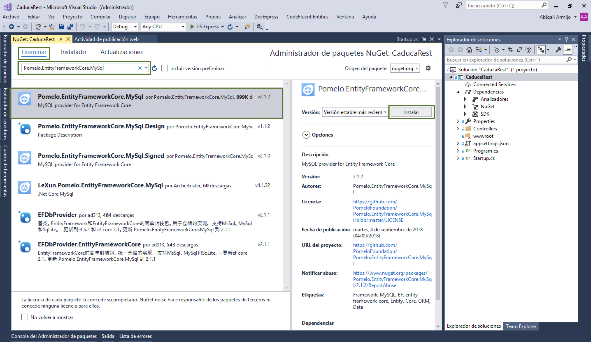

# 3.3 Paquetes Nuget

.Net cuenta con librerías con funciones generales las cuales son desarrolladas por Microsoft y otras empresas para poderlas reutilizarlas en tus proyectos.

Nuget \([www.nuget.org](www.nuget.org)\)  es el repositorio oficial de microsoft para descargar e integrar los paquetes a tu proyecto.

Se necesitarán los siguientes paquetes

| Paquete | Descripción |
| :--- | :--- |
| Microsoft.EntityFrameworkCore.Relational | Componentes para manejar la base de datos  |
| Pomelo.EntityFrameworkCore.MySql | Permite utilizar una base de datos Mysql.  |
| Microsoft.EntityFrameworkCore.InMemory | Permite utilizar una base de datos en memoria. |
| Swashbuckle.AspNetCore | Permite generar la documentación de tus servicios REST |

### 3.1 Instalar paquetes Nuget con Visual Studio Comunity

1. Clic derecho sobre el proyecto -&gt; Administrar Paquetes Nuget

2. Dar clic en la pestaña **Examinar** y teclear el nombre del paquete que deseas instalar en este caso **Pomelo.EntityFrameworkCore.MySql** al instalar este paquete instalara todos los paquetes necesarios e instalara también el paquete Microsoft.EntityFrameworkCore.Relational

A continuación, te mostrará una ventana con todos los paquetes a instalar y/o actualizar

Algunos paquetes cuentan con licencia por lo cual debes aceptar los términos de la licencia. Da clic en aceptar

### 3.2 Instalar paquetes Nuget con comandos

También puedes instalar los paquetes con comandos.

1. Dar clic en **Herramientas -&gt; Administrador de paquetes Nuget -&gt; Consola del Administrador de paquetes**

2. Teclear el comando **Install-Package Microsoft.EntityFrameworkCore.InMemory**

### 3.3 Instalar paquetes Nuget con Visual Studio for Mac

1. En el proyecto clic derecho del mouse sobre la opción **Nuget** luego dar clic en **Agregar paquetes...**

2. Teclear el nombre del paquete **Swashbuckle.AspNetCore** presionar ****ENTER seleccionamos el paquete y damos clic en **Agregar paquetes**

