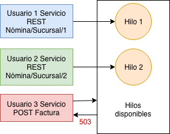
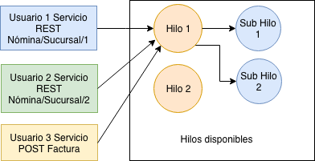

# 2.7 Programación asíncrona

Cuando programamos el código se va ejecutando en el orden en el que fue escrito línea por línea no ejecuta todo el código al mismo tiempo, si no que va siguiendo las instrucciones y hasta terminar una instrucción ejecuta la siguiente línea de código.  

Cuando tienes un proceso muy largo este comportamiento no es el deseado, ya que por ejemplo si quieres descargar un archivo de 5 gb en tu computadora, no podrías realizar ninguna otra actividad como lo es navegar por internet o escuchar música, ya que deberías esperar a que el archivo termine de descargarse antes de poder realizar otra acción. 

Los procesadores actuales te permiten ejecutar varias tareas a la vez, para esto cada tarea la ejecuta en lo que se conoce como hilos así tu procesador por ejemplo puede ejecutar 100 tareas a la vez cada una en un hilo diferente. Puedes programar tu código para que si tienes un proceso muy largo, como por ejemplo calcular la nómina de 5,000 trabajadores del mes actual y este proceso tarda 5 minutos puedes indicar que este proceso lo ejecute en un hilo diferente y así pueda atender a los demás usuarios sin que los demás usuarios esperen a que se termine el cálculo de la nómina. Los procesadores tienen un número limitado de hilos y el utilizar hilos incrementa el uso de la memoria, por lo cual debes utilizar la programación asíncrona solo para procesos muy largos como por ejemplo una importación de 10,000 artículos de excel a tu base de datos.

Aquí muestro un ejemplo con servicios REST donde 2 usuarios realizan la petición al servicio rest que calcula la nómina de los empleados de su sucursal de forma síncrona el cual es el funcionamiento por defecto, si llega un tercer usuario a querer por ejemplo realizar una factura obtendría un error 503 de servidor no disponible ya que se encuentra ocupado atendiendo a los 2 primeros usuarios 



De forma asíncrona el servicio rest de la nómina crea otro hilo que se encargará de realizar el cálculo de la nómina y queda disponible inmediatamente para atender otro usuario.



En .NET se ha simplificado el trabajar con funciones asíncronas, solo necesitas agregar la palabra **await** antes de la función que puede tardar mucho tiempo, esta palabra le indica al procesador que no puede continuar con la siguiente línea de código hasta que la función asíncrona se complete, y libera el hilo para que atienda otros procesos. Cuando se termine de realizar el proceso largo el sub hilo regresa el control a la línea con la palabra await que lo mandó llamar y puede continuar con la siguiente línea de código de tu programa. Cuando incluyes la palabra await tu función debe regresar un objeto Task que es el que se encargará de ejecutar el proceso tardado y de esperar a que termine para regresar el resultado de tu función.

Por convención los métodos asíncronos termina con la palabra Async. Un ejemplo sería el siguiente

```csharp
public class Nomina
{
    public string mensajeError;
    public Task<int> CalculaNominaAsync(int sucursalId)
    {
          var totalEmpleadosCalculados = await
                          CalculaQuincenalAsync(sucursalId)
          if (totalEmpleadosCalculados==0)
               mensajeError = "No se calculo la nómina de 
                                    ningún empleado";
           return totalEmpleadosCalculados;          
    } 
}
```

También se recomienda utilizar programación asíncrona en tus app o aplicaciones de escritorio, para que si tienes un proceso que consuma mucho tiempo lo realices en otro hilo, así el usuario puede continuar utilizando tu aplicación sin que parezca que dejo de responder.

Puedes consultar la documentación oficial sobre la programación asincrónica aqui: [https://msdn.microsoft.com/es-mx/library/hh191443\(v=vs.120\).aspx](https://msdn.microsoft.com/es-mx/library/hh191443%28v=vs.120%29.aspx)


