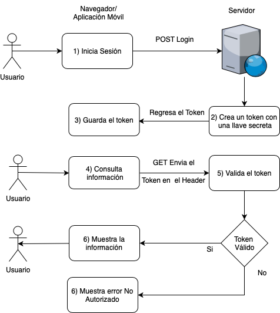

# 9. Seguridad

Debido a que tus servicios REST son públicos, debes controlar el acceso a cada uno de los servicios, en lugar de enviar usuario y password del usuario en cada petición lo que se envía es un token, el cual es generado cuando inicias sesión.

### Seguridad basada en tokens

Una forma común de manejar la seguridad en tus servicios, es mediante tokens. El funcionamiento es el siguiente:

1. El usuario inicia sesión ya sea en una aplicación móvil o en navegador. Internamente se envía una petición POST con el usuario y contraseña del usuario (se recomienda https)
2. El servidor valida el usuario y contraseña enviados y genera un token, el cual es una cadena codificada donde agrega información como el Id del usuario, los roles que tiene el usuario, y el tiempo en el cual este token es válido por ejemplo 1 hora, 2 horas, 1 día. Una vez caducado el token el usuario debe volver a iniciar sesión o pedir una renovación del token.
3. El navegador o la aplicación recibe el token y lo guarda. Se puede guardar el token en el local storage de la página si es una aplicación web o en los datos de tu aplicación móvil. Por motivos de seguridad si guardas el token en el local storage o en un cookie no deben tener una duración muy grande. También puedes agregar otra validación como por ejemplo la IP de la cual el usuario realizó el login, para que si un hacker obtiene el token e intenta acceder desde otra ciudad o país notificar al usuario para cancelar el token y denegar el servicio hasta que el usuario apruebe el acceso.
4. El usuario consulta  información del sistema, como por ejemplo la lista de clientes. En el servicio GET para la lista de clientes, en el header se envía el token que el servidor regreso en el paso 2.
5. El servidor válida el token si es válido y el usuario tiene permiso para consultar la información regresa la información, si no regresa un código de error (403) Forbidden.

