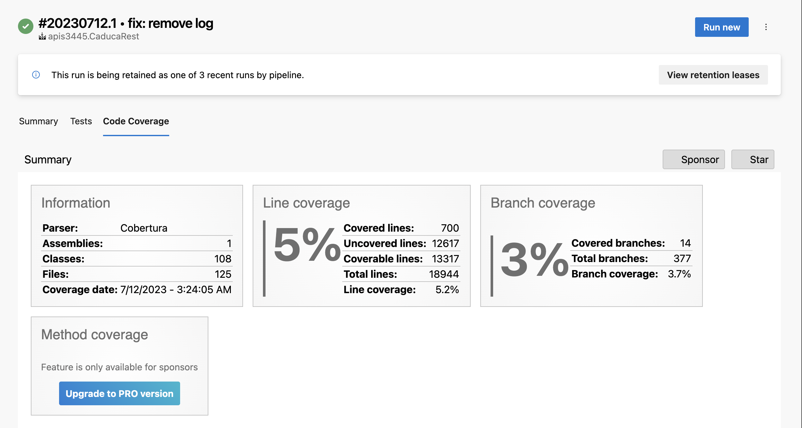

# 11.3 Integración continua y pruebas automáticas en Azure DevOps

Para configurar Pipelines con Azure DevOps nos registramos en el siguiente link

[https://azure.microsoft.com/es-es/services/devops/pipelines/](https://azure.microsoft.com/es-es/services/devops/pipelines/)\
\
De momento debes llenar el siguiente formulario para tener agentes de forma gratuita

[https://aka.ms/azpipelines-parallelism-request](https://aka.ms/azpipelines-parallelism-request)

.png>)

Creamos un nuevo proyecto, elegí público para que este disponible sin restricciones de acceso por usuarios.

.png>)

Seleccionamos GitHub

.png>)

Seleccionamos el repositorio donde tenemos el código en mi caso es CaducaRest

.png>)

Seleccionamos la opción: **ASP .NET Core (.NET Framework)** esta opción te configura el pipeline para generar el build de tu proyecto y luego ejecutar el proyecto de pruebas automáticas

.png>)

Edita la tarea para indicar la versión de .net por lo general a veces las nuevas versiones de .net tardan un poco en estar en Azure Pipelines. Si ves algún error en el pipeline relacionado a la versión de .net puedes instalar la versión que necesitas con este task

```yaml
- task: UseDotNet@2 
  displayName: "Instalar .NET Core 7.0.x"
  inputs:
        version: '7.0.x'
        performMultiLevelLookup: true
        packageType: sdk
```

La parte de pruebas la cambiamos para agregar el nombre de nuestro proyecto de pruebas unitarias.&#x20;

Agregamos una tarea de .Net Core

.png>)

Especificamos las siguientes opciones:

* **Command**: Seleccionamos **test** de este manera ejecutaremos nuestro proyecto de pruebas unitarias.
* **Path to projects(s):** Tecleamos la ruta de nuestro proyecto de pruebas unitarias en este caso es **\*\*/xUnit.CaducaRest/.csproj**&#x20;
* **Arguments:** Tecleamos **'**-**-configuration $(buildConfiguration) /p:CollectCoverage=true /p:CoverletOutputFormat=cobertura /p:CoverletOutput=$(Build.SourcesDirectory)/TestResults/Coverage/'** con esto indicamos que haga el build en release como esta en las variables al inicio. Con la opción **collect "Code Coverage"** se revisa la cantidad de código que tenemos con casos de prueba unitarias y nos indica en un porcentaje del 0 al 100 que tanto porcentaje del código tenemos probado.
* **Test run title:** puedes poner un título en mi caso fue **Unit Test.**&#x20;

.png>)

El código queda de la siguiente manera:

```yaml
- task: DotNetCoreCLI@2
  displayName: Testing Unit Test
  inputs:
    command: 'test'
    projects: '**/xUnit.CaducaRest/*.csproj'
    arguments: '--configuration $(buildConfiguration) /p:CollectCoverage=true /p:CoverletOutputFormat=cobertura /p:CoverletOutput=$(Build.SourcesDirectory)/TestResults/Coverage/'
    testRunTitle: 'Unit Test'
```

Agrega otro task Publish Code Coverage Results

* Code coverage tool: Selecciona Cobertura
* Summary File: Es el archivo generado en el paso anterior. Teclea **'$(Build.SourcesDirectory)/\*\*/coverage.cobertura.xml'**

.png>)

Da clic en **Add**.&#x20;

El código queda:

```yaml
- task: PublishCodeCoverageResults@1
  displayName: 'Publish code coverage report'
  inputs:
    codeCoverageTool: 'Cobertura'
    summaryFileLocation: '$(Build.SourcesDirectory)/**/coverage.cobertura.xml'
```

Y damos clic en Run

.png>)

Si todo es correcto vemos esta pantalla

.png>)

Podemos ver los pasos que se están ejecutando

.png>)

Si todo es correcto vemos esta pantalla

.png>)

Puedes dar clic en la sección VSTest y verás el resultado de tus pruebas, te llega un correo con el resultado del build

.png>)

En la parte de Summary te genera un resumen de los Test que pasaron, y la cobertura de código, la cual te indica el porcentaje de código que contiene pruebas automáticas. En el ejemplo solo el 6.11% del código tiene alguna prueba automática.

.png>)

Da clic en Code Coverage para ver el resumen donde por cada archivo indica cuantas líneas han sido probadas. Un buen porcentaje es el 80% de tu código. Te marca el archivo que mas riesgo tiene, en este caso es CustomMySQLException. El Cyclomatic complexity indica que tan complejo es tu código ya que tiene muchos if anidados, while, funciones muy largas, entre mayor sea el número es mas difícil de probar y puede ser una señal de que la clase hace demasiadas cosas a la vez.

<figure><figcaption></figcaption></figure>

Si das clic en un archivo ves el resumen

.png>)

<figure><figcaption></figcaption></figure>

Te marca en verde el código que incluye al menos un un caso de prueba y en rojo lo que no tiene ningún caso de prueba.

.png>)


Otra opción importante es el mutating testing. Donde se incluyen variaciones a las pruebas. Ejemplo si debes probar una operación de sumar, incluye tests para probar que si cambias el signo de la función sumar por -,/,\* y los test deben fallar. Si no fallan tú test esta mal. Puedes ver mas información [https://github.com/stryker-mutator/stryker-net](https://github.com/stryker-mutator/stryker-net)


Cambiamos la función Sumar para que reste, le damos commit para ver el error, de esta forma cada vez que realices un commit se ejecutaran las pruebas con Azure DevOps

.png>)

Si damos clic vemos el detalle

.png>)

El archivo yaml queda de la siguiente forma

```yaml
# ASP.NET Core (.NET Framework)
# Build and test ASP.NET Core projects targeting the full .NET Framework.
# Add steps that publish symbols, save build artifacts, and more:
# https://docs.microsoft.com/azure/devops/pipelines/languages/dotnet-core

trigger:
- master

pool:
  vmImage: 'windows-latest'

variables:
  solution: '**/*.sln'
  buildPlatform: 'Any CPU'
  buildConfiguration: 'Release'
  system.debug: false

steps:

- task: UseDotNet@2 
  displayName: "Instalar .NET Core 6.0.x"
  inputs:
        version: '6.0.x'
        performMultiLevelLookup: true
        packageType: sdk
        
- script: dotnet build --configuration $(buildConfiguration)
  displayName: 'Build Project $(buildConfiguration) '

- task: DotNetCoreCLI@2
  displayName: Testing Unit Test
  inputs:
    command: 'test'
    projects: '**/xUnit.CaducaRest/*.csproj'
    arguments: '--configuration $(buildConfiguration) /p:CollectCoverage=true /p:CoverletOutputFormat=cobertura /p:CoverletOutput=$(Build.SourcesDirectory)/TestResults/Coverage/'
    publishTestResults: true
    testRunTitle: 'Unit Test'

- task: PublishCodeCoverageResults@1
  displayName: 'Publish code coverage report'
  inputs:
    codeCoverageTool: 'Cobertura'
    summaryFileLocation: '$(Build.SourcesDirectory)/**/coverage.cobertura.xml'
  
```
