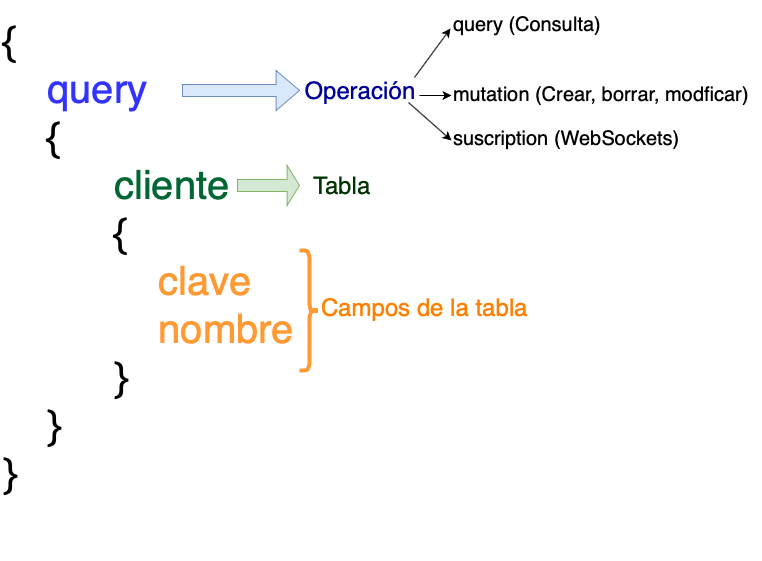

# 6.3 GraphQL

GraphQL fue desarrollado por Facebook para facilitar la consulta de información, por ejemplo una aplicación para celulares suele contener menos información que una aplicación web, por lo cual en lugar de crear 2 servicios, se crea un lenguaje para traer solamente la información que se necesita.

De momento no cuenta con librería oficial por parte de microsoft. El paquete nuget requerido es [GraphQL ](https://github.com/graphql-dotnet/graphql-dotnet)de Joe McBride

La estructura de GraphQL esta formada por 3 partes

1. Operación
2. Tabla y/o datos
3. Campos de la tabla



GraphQL se basa en enviar las peticiones por medio de consultas, se tienen 3 tipos:

1. **Query**: Para consultar inofrmación
2. **Mutation**: Para modificar información \(crear, borrar, modificar\)
3. **Subscription**: Para WebSockets \(con WebSockets puedes por ejemplo recibir notificaciones cuando ocurre algún evento\)

Un ejemplo para obtener la clave y nombre de los clientes sería el siguiente:

```text
http://myapi/graphql?query={clientes{clave, nombre}}
```

Esta petición genera el siguiente resultado

```javascript
{
  "data": {
    "clientes": [
      {
        "Clave": 1,
        "Nombre": "John Doe"
      },
      {
        "Clave": "2",
        "Nombre": "Alicia Smith"
      }
    ]
  }
}
```

###  Agregar  paquetes Nuget para habilitar graphQL en .NET Core

Vamos a agregar los siguientes paquetes Nuget para habilitar GraphQL en nuestro proyecto

```text
Install-Package GraphQL 
Install-Package GraphQL.Server.Transports.AspnetCore
```

Para poder probar los servicios podemos utilizar el siguiente paquete el cual es similar a Swagger ya que nos genera la documentación y nos ayuda a probar nuestros servicios

```text
Install-Package GraphQL.Server.UI.Playground
```

La estructura básica es la siguiente:

* GraphType: Permite indicar los campos del modelo que estan disponibles para el servicio, los tipos de datos comunes de .net como int, string tienen su equivalente para graphQL
* Query: Permite configurar nuestro objetoGraphType\(Modelo\) con nuestra base de datos para llenar los campos del modelo
* Schema: Nos permite definir las operaciones a realizar: Query\( Consulta información\), Mutation: \(Crear, Borrar, Modificar\), Suscripcion\(Operaciones con WebSockets\)


Vamos a crear nuestra tabla caducidad la cual contendra los datos del cliente y del producto para realizar la consulta de la siguiente manera:

```javascript
{
	"query": "query {
		caducidades {
			id
			producto {
				id
				clave
				nombre
			}
			cliente
			{
				id
				nombreComercial
			}			
		}	
   }"
} 
```

Este método se podrá consultar por GET o por POST, es mas comodo realizarlo por POST.

