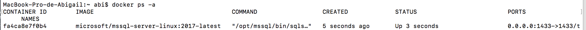
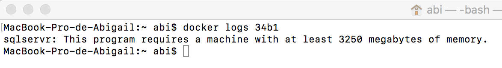
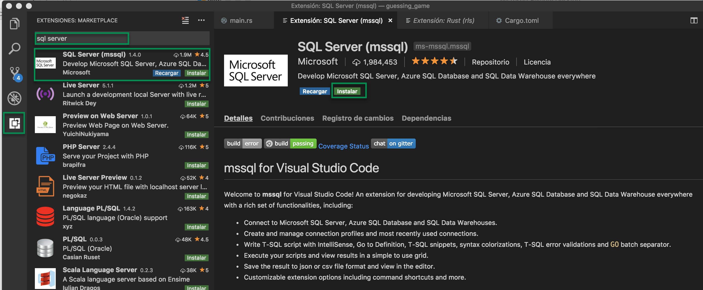

# 1.2 Instalación de SQL Server en Mac

La instalación de SQL Server en Mac se realiza mediante Docker. 

Docker es un programa que te permite crear contenedores de tu aplicación en el cual tu incluyes todo lo necesario para que aplicación funcione correctamente. Así puedes tener tu aplicación en diferentes servidores que tengan Docker instalado sin configurar todo manualmente y resolver el problema muy conocido en mi máquina funciona.

Los pasos son los siguientes

1. Descargar e instalar Docker de la siguiente dirección: [https://www.docker.com/get-started](https://www.docker.com/get-started)
2. Configurar Docker para que funcione con 4 Gb de memoria. Este es un requisito de SQL Server Para esto dar clic el icono de Docker -&gt; Preferences -&gt; Advanced -&gt; Memory -&gt; 4 GB \(Figura 2.1.1\)
3. Obtener la imagen de Sql Server desde  la línea de comandos `sudo docker pull microsoft/mssql-server-linux:2017-latest`
4. Correr la imagen de SQL Server, necesitas aceptar los términos de la licencia, definir el password para el usuario sa el cual debe ser complejo definir el puerto en el cual va a correr SQL Server `sudo docker run -e 'ACCEPT_EULA=Y' -e 'SA_PASSWORD=MiPassw0rd!1521' -p 1433:1433 -d microsoft/mssql-server-linux:2017-latest`


La contraseña debe tener al menos 8 caracteres y contener  3 de los siguientes 4 conjuntos: mayúsculas, minúsculas, dígitos y símbolos, de lo contrario no funcionará


Se puede ejecutar el comando para comprobar que sql server esta corriendo correctamente  
`docker ps -a`  
El estatus debe ser Up 

Si Sql Server no está corriendo puedes ver el log con el comando docker logs seguido de las primeras 4 letras del container ID de SQL Server

`dockers logs 34b1`

El SQL Management Studio no se encuentra disponible para Mac para la cual tienes 2 alternativas: 

1. Utilizar **Azure Data Studio** antes llamado _SQL Operations Studio_ [_https://docs.microsoft.com/en-us/sql/azure-data-studio/download?view=sql-server-2017_](https://docs.microsoft.com/en-us/sql/azure-data-studio/download?view=sql-server-2017) __

 2. Utilizar la extensión de _SQL Server\(mssql\)_ en _Visual Studio Code_

