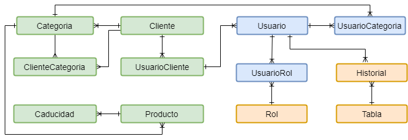

# 1.3 Aplicación de Ejemplo

La aplicación de ejemplo para crear los servicios REST es la siguiente:

La empresa ACME desea llevar el control de la fecha de caducidad de los  productos de sus clientes, para mandar avisos de los productos que están próximos a caducar. Los productos están ordenados por categorías, y los empleados solo pueden registrar las fechas de caducidad de sus categorías de productos. También desde llevar un historial de quien ha registrado la información del sistema.


La seguridad será manejada por roles, para este ejemplo un usuario puede tener varios roles.


### Modelo Base de Datos

Actualmente el Entity Framework Core no genera un diagrama visual de las tablas de la base de datos, por lo cual el modelo lo cree con [Draw.io](https://www.draw.io) el cual tiene una versión web, versiones para windows, linux y mac.

Para dejar el ejemplo lo mas sencillo posible el diagrama de la base de datos es el siguiente:

* **Rol:** Roles para la seguridad sistema \(Ver sección seguridad\)
* **Tabla:** Contiene el nombre de cada tabla para registrar el historial por cada tabla
* **Historial:** Histórico de cambios del sistema
* **Cliente:** Clientes de la empresa
* **Categoría:** Clasificación de los productos
* **Producto:** Información de los productos
* **Caducidad:** Registro de la fecha de caducidad de los productos
* **Usuario:** Personas que utilizan la aplicación
* **UsuarioCategoria:** Registra las categorías de productos que cada persona puede manejar.
* **UsuarioRol:** Registra los roles de cada usuario

### Seguridad

La aplicación cuenta con los siguientes tipos \(roles\) de usuarios:

* **Administradores:** Pueden consultar y modificar toda información del sistema. Se encargar de dar de alta nuevos clientes.
* **Supervisores:** Pueden dar de alta las categorías y productos de cada cliente. Los usuarios de un cliente no pueden consultar ni modificar la información de otros clientes.
* **Empleados:** Pueden registrar las fechas de caducidad de los productos del cliente de sus categorías asignadas.

