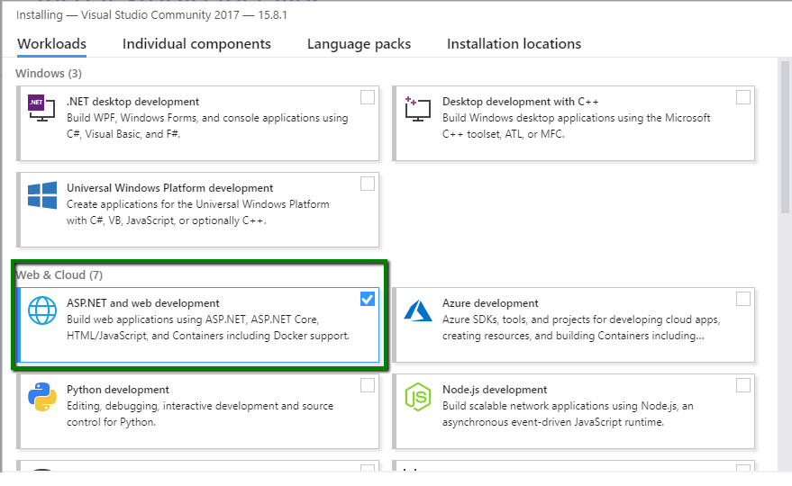
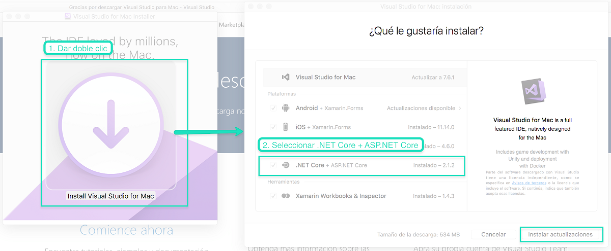

# 1.1 Instalación Visual Studio Comunity


Aunque los pasos pueden cambiar debido a nuevas versiones de Visual Studio los pasos para instalar .NET Core son los siguientes:


### Instalación Nueva

1. Descargar la ultima versión de Visual Studio Comuity \([https://visualstudio.microsoft.com/es/downloads/](https://visualstudio.microsoft.com/es/downloads/)\)
2. Elegir la opción:  **ASP.NET and web development**  \(Figura 1.1.1\)
3. Dar clic en **Instalar**

Para mac

1. Da doble clic en **Install Visual Studio for Mac**
2. Selecciona **.NET Core + ASPNET Core**
3. Da clic en Instalar, en mi caso como ya lo tengo instalado y hay una versión me sale el botón Instalar actualizaciones

