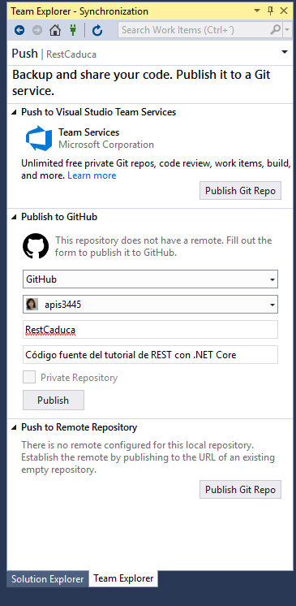

# 3.2 Integrando tu código fuente a GitHub

Para crear tu proyecto REST desde Visual Studio Comunity los pasos son los siguientes:

1. Ir al menú **Archivo** -> **Nuevo** -> **Proyecto**
2. Teclear el nombre del proyecto (**CaducaRest**) y la ubicación donde se creará el proyecto
3. Seleccionar la opción **Guardar**
4. Elegir **.NET Core 3.1** y seleccionar el proyecto de **API**.&#x20;
   1. Se recomienda usar los servicios REST con un certificado HTTPS si deseas manejarlo selecciona configure for HTPPS&#x20;

### Instalar la extensión de GitHub

Para agregar tu proyecto a GitHub puedes descargar la extensión de GitHub.

1. Ir a **Herramientas** -> **Extensiones y Actualizaciones**
2. En la pestaña de **En Línea** -> **Buscar** -> **GitHub** y dar clic en **Descargar**

Las extensiones se instalan al cerrar y volver a abrir el Visual Studio

1. Cerrar Visual Studio y volverlo a abrir.&#x20;
2. Dar clic en modificar
3. Dar clic en iniciar

### Agregar tu proyecto a GitHub

1. Abrir tu proyecto&#x20;
2. Dar clic en el menú **Equipo**
3. **Administrar Conexiones**
4. Dar clic en **publish to GitHub**
5. Iniciar sesión con tu cuenta de GitHub
6. Seleccionar tu usuario, el nombre del repositorio y opcionalmente una descripción

Listo tu proyecto se ha publicado en GitHub

### Obtener el código desde Visual Studio for Mac

Para obtener el código fuente realizamos lo siguiente

1. En el menú **GIT** -> **Clonar repositorio**
2. En la URL seleccionamos la URL del proyecto de GitHub [https://github.com/apis3445/CaducaRest.git](https://github.com/apis3445/CaducaRest.git)
3. Seleccionar el directorio de destino donde deseas guardar el código
4. Dar clic en **Clonar**

.png>)
