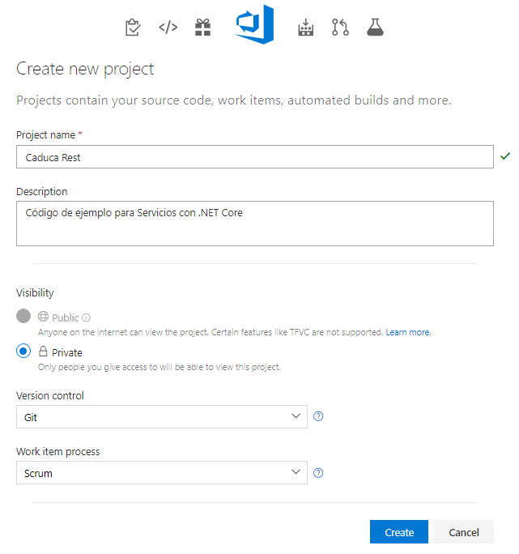

# 2.1.1 Crear un nuevo Proyecto

1. Dar clic en New Project y teclea los datos de tu proyecto. En mi caso utilizare Scrum

2. Para agregar  a los usuarios al proyecto, desde la página de Project dar clic  **Settings,** seleccionar la pestaña **Users**. Dar clic en **Add New User** y teclear el correo de las personas que trabajaran en el proyecto. La versión gratuita te permite un máximo de 5 usuarios.

3.Ahora vamos a definir las tareas para el sistema. En la pestaña de **\[Work\]**, dar clic en la pestaña **\[Backlogs\]**  dar clic en **\[Set Dates\]** para configurar la fecha inicial y final del sprint

