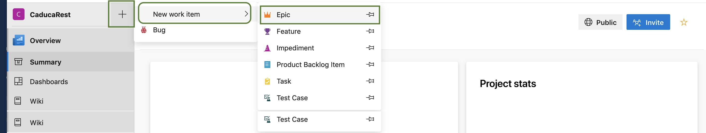

# 2.1.3 Agregar Backlogs y Tareas

Ahora vamos a definir las tareas que vamos a entregar en el sprint. Como Epic puedes agregar también de manera general los módulos de tu sistema. 

Voy a agregar un **Epic** para el **Módulo de Administración**. Para esto damos clic en el botón **+** que se encuentra arriba al lado del nombre del proyecto. Seleccionamos **New work item** y luego **Epic**

Como nombre agregamos **Módulo Administración** agregamos una **descripción** general del módulo, definimos los **criterios de aceptación**, esto es lo que el cliente pide como requisito para aceptar el módulo, puedes agregar fechas estimadas de inicio y de fin, la prioridad. Puedes agregar links como por ejemplo si el cliente tiene alguna idea de diseño basado en otras páginas, o puedes agregar archivos adjuntos si el cliente ya tiene un diseño especifíco que desee. Agrega el responsable del módulo, mas adelante explicare como agregar mas miembros al equipo.

Al dar clic en guardar se nos creo el resumen del proyecto

En la opción de Work Items vemos el item creado.

Vamos a agregar los backlogs, que son las tareas de forma general.

1. Da clic en **Backlogs** y luego en **New Work Item** agregamos el nombre, en mi caso mi tarea sea **Análisis**, y luego damos clic en **Add to top**.

2. Vamos a agregar los datos del backlog, nuestro primer backlog va a ser **Análisis**, donde vamos a registrar de forma general las tareas de análisis que se requieren en cuaquier sistema. 

El backlog se agrega. Del lado izquierdo se muestran los backlog y del lado derecho los sprint, que como comente antes son las entregas las cuales son por lo general de tiempo corto, por ejemplo 2 semanas.

3. Para agregar las tareas al backlog damos clic en el botón **+** que se encuentra del lado izquierdo del backlog. Agregamos el nombre de la tarea, **Junta Inicial con el cliente**, la persona que realizará la junta, la **descripción**, prioridad, la cantidad de trabajo que se necesita para completar la tarea, y el tipo de actividad a realizar **Requirements**

4. Agregamos las demás tareas 

Del lado derecho vemos que se van agregando todas las tareas al primer sprint, vamos a arrastrar las 2 últimas tareas al segundo spring, arrastrandolas del lado izquierdo al lado derecho en el recuadro de sprint 2, así vemos que el sprint 1 tiene 3 tareas y el sprint 2, tiene 2 tareas.

### 2.1.3.1 Como definir las tareas

Antes de empezar a programar o pensar en las soluciones debes pensar mucho en el problema, preguntar por ejemplo 5 veces el porque y el para que es necesaria realizar tal opción. Al pensar mas en el problema y observando como es el proceso actual antes de empezar a programar puedes entregar un sistema que no este cambiando tan constantemente. Es mejor dedicar un buen tiempo a analizar y probar las posibles soluciones junto con los usuarios, desde el inicio prototipos antes de definir y estimar tiempos.


Una buena forma de registrar las tareas a realizar es incluir lo que requieren hacer las personas, que problema se soluciona, que está pasando por  no contar con esta función y qué es lo que esperan obtener 


**Ejemplo:** 

Las personas desean poder realizar comprar en el sitio web sin tener que registrarse. Es más fácil para ellos registrarse con su login de linkedin, facebook o google.

Actualmente según los datos de google analytics mucha gente al ver el formulario de registro abandona la página y su carrito de compras, por lo cual se están perdiendo posibles ventas.

 Se espera que al agregar este login con redes sociales se incrementen las ventas en línea.

