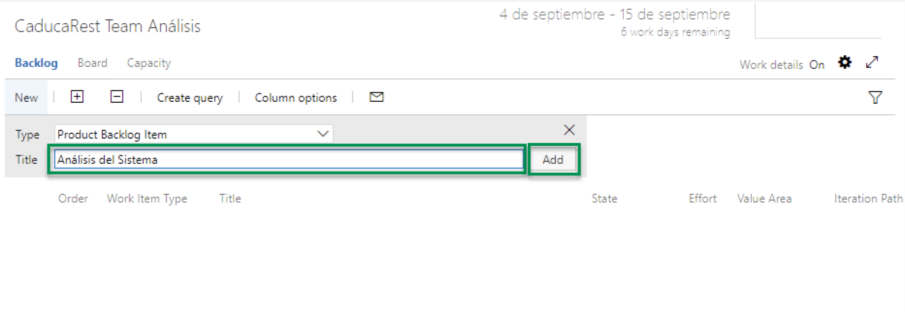
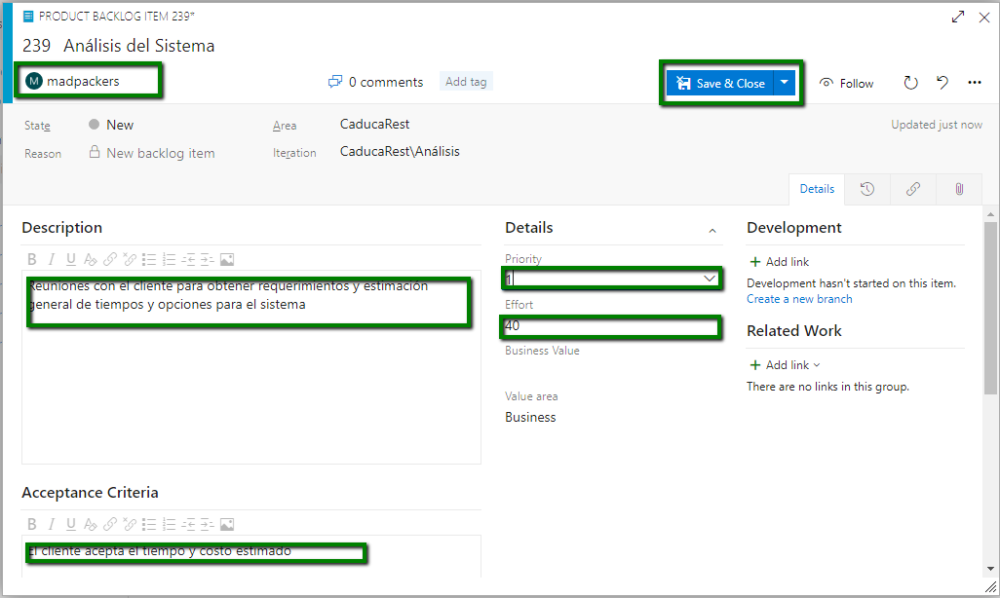
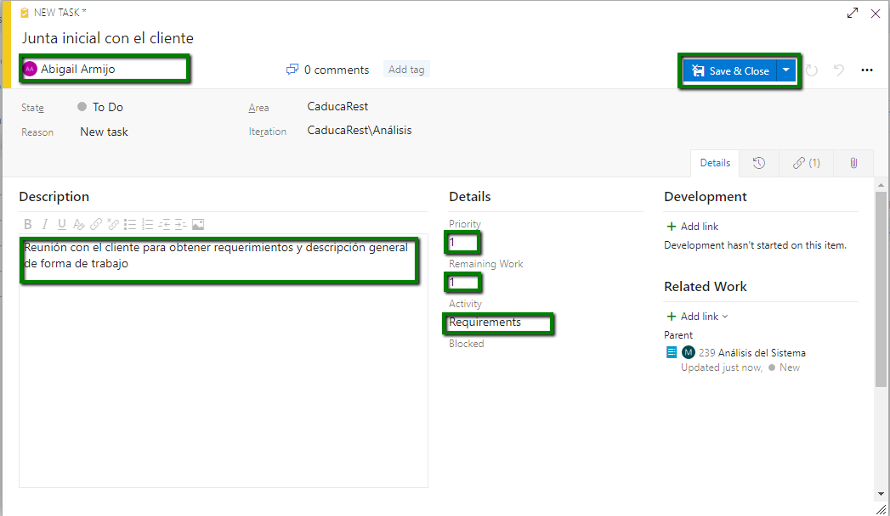
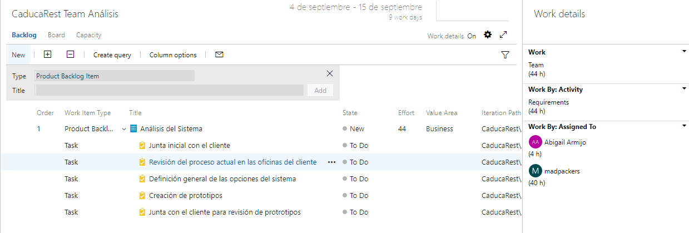

# 2.1.2 Agregar Backlogs y Tareas

Ahora vamos a definir las tareas que vamos a entregar en el sprint. 

1. En la opción de Title elegimos el título del backlog a realizar. En este ejemplo la primer tarea es el **Análisis del Sistema** y damos clic en el botón **Add**

2. Damos clic en el Backlog creado para asignar esa actividad a un programador y definir de forma general las actividades y el tiempo estimado

3. Damos clic en el botón **+** que esta al lado del backlog para detallar las tareas del backlog

4. Agregar las demás tareas para entregar en el primer sprint

### 

