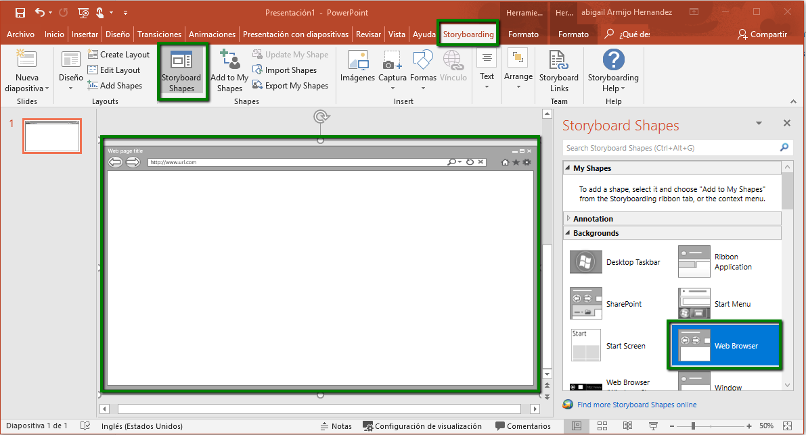

# 3.1.5 Crear Prototipos

Se recomienda siempre que se realiza un nuevo sistema realizar prototipos. Hay diferentes herramientas para generar tus prototipos:

&#x20;    1\. **Sketch2Code**: Puedes realizar tus prototipos en un papel y con lápiz y luego con la herramienta subir tu imagen a [https://sketch2code.azurewebsites.net/](https://sketch2code.azurewebsites.net/) generar un html con tu diseño. Deben ser diseños sencillos ya que muy elaborados no los genera.

&#x20;    2\. **PowerPoint**: Al instalar Visual Studio Comunity si ya tienes PowerPoint instalado te agrega una pestaña de **StoryBoarding** para que crees tus prototipos

3\. **Uizard**: Te permite subir tus imágenes en lápiz y papel y te crea un diseño ya sea para app o aplicación web. Además te permite exportar el diseño a HTML, React, Vue o Angular

Al aprobarse los prototipos es importante crear prototipos mas funcionales y realizar encuestas con los usuarios para ver si el prototipo es claro o pruebas de A/B testing en donde creas 2 diseños para ver cual es el mas efectivo.

La parte más importante es el diseño y hay que probar y mostrar tus ideas a tus usuarios potencianles antes de empezar a programar, ya que es más fácil cambiar un prototipo a cambiar una opción ya programada entre mas tiempo tardes en mostrar y recibir feedback una nueva función porque le vas agregando cosas que piensas que van a necesitar es mas díficil de adecuar el sistema.

Para realizar prototipos más funcionales puedes utilizar las siguientes herramientas:

1. [Adobe XD](https://www.adobe.com/products/xd/features.html)
2. [Invision Studio](https://www.invisionapp.com/studio)
3. [Figma](https://www.figma.com)
4. [Marvelapp](https://marvelapp.com/)
5. [Justinmind](https://www.justinmind.com/)

Para realizar pruebas A/B puedes utilizar. Para estas pruebas presentas 2 diseños al usuario, haces una encuesta con los posibles usuarios, para  realizar una tarea, por ejemplo puedes dar 2 diseños de carrito de compras y pedirle al usuario que encuentre el botón de agregar al carrito o de pagar y en el que los usuarios encuentren mas fáciles o simplemente preguntar cual diseño les gusta más.

1. [Helio](https://helio.app)
2. [AB Tasty](https://www.abtasty.com/es/solucion-ab-testing/)

###
