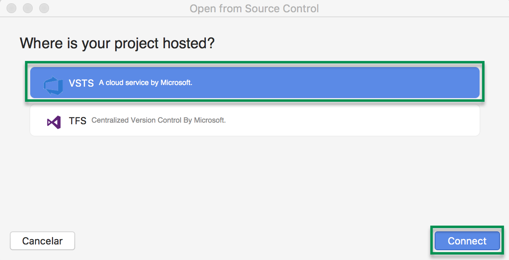

# 2.1.6 Consultar tus tareas pendientes

## 2.1.6.1 Consultar desde el navegador

Puedes ver la lista de tareas del proyecto en un kanboard  para el sprint actual. Puedes ver las tareas del proyecto en un Kanboard o en el Dashboard.

#### 2.1.6.1.1 Ver las tareas del proyecto en Kanboard

1. Inicia sesión con tu cuenta en [Azure DevOps](https://visualstudio.microsoft.com/vso)
2. Selecciona tu proyecto
3. Da clic en **Board** y luego en **Board.**

Se muestran 4 columnas:

* **New**: Muestra las nuevas tareas
* **Approved**: Muestra las tareas aprobadas por el cliente
* **Commited**: Muestra las tareas que ya tienen el commit
* **Done**: Muestra las tareas que ya se entregaron y se aceptaron por parte del cliente.

Puedes cambiar los estados que se muestran en la opción board, para esto entra a azure dev ops

1. En la página de proyectos, la cual se accede dando clic en **Azure DevOps**,luego selecciona la opción **Organization settings**

2. En la sección **Boards**, da clic en Process, luego da clic en la metodología en mi caso es **Scrum.** Damos clic en los **...** y seleccionamos ****la opción **Create inherited process**

3. Tecleamos un nombre en mi caso es **Scrum** Personalizado y damos clic en **Create process**.

4. Damos clic en la opción que creamos

5. Damos clic en Product Backlog Item

6.Damos clic en la pestaña States y luego damos clic en la opción New state, a continuación tecleamos los datos del nuevo estado y damos clic en el botón Create.

#### 2.1.6.1.2 Ver las tareas  como sprint

Puedes dar clic en la opción de Sprints, para ver las tareas del sprint de forma detallada. Para modificar el avance la tarea, puedes dar clic en la opción State y seleccionar el estado adecuado, o puedes arrastrar las tareas de una columna a otra.

#### 2.1.6.1.3 Ver las tareas en el Dashboard

Vamos a crear un nuevo Dashboard

1. Vamos a la página de **Azure DevOps**, damos clic en **Dashboards**, luego en el botón **Add a widget**.

Del lado izquierdo se muestran unos cuadros, donde podemos ir arrastradno los widgets que se encuentran del lado derecho. Algunos de los mas utilizados son los siguientes:

* **Welcome:** Incluye los siguientes links para realizar las siguientes actividades:
  *  Agregar nuevas tareas.
  * Agregar el código a tu repositorio.
  * Una vez que tienes tu código, te permite automatizar tus builds para publicarlo.
  * Consultar las gráficas de avance de las tareas.
* **Assigned to Me:** Indica las tareas asignadas a ti.
* **Team Members:** Te permite agregar mas personas al proyecto.
* **Sprint Overview:** Te muestra el avance del sprint de forma gráfica.
* **New Work Item:** Te permite agregar una nueva tarea.
* **Work in Progress:** Te muestra el número de tareas que se estan realizando.
* **Sprint Burndown**: Te muestra de forma gráfica como va el avance del sprint.
* **Query Tile**: Te permite realizar un query para por ejemplo contar el número de tareas que no se han iniciado
* **Visual Studio shortcuts:** Te permite agregar el proyecto en Visual Studio o instalar Visual Studio.
* 
Un ejemplo de un dashboard puede ser el siguiente:

Agregue el widget **Welcome**, en la esquina superior izquierda, al lado derecho agregue **Assigned to Me**, luego **Team Members**, abajo de Team Members, **New Work Item**, en el segundo renglón por asi decirlo agregué Sprint Overview, luego Visual Studio Shortcuts, luego Sprint Burndown y por útlimo Query Tile este último requiere una configuración adicional. Al final damos clic en **Done Editing**

A continuación te muestra el resultado si deseas modificarlo o agregar mas widges da clic en el botón Edit

#### 2.1.6.1.4 Agregar querys.

Vamos a agregar un query para agregar las tareas que estan en progreso.

1. Damos clic en **Boards**, luego en **Queries** y por último en **New Query**

2. En **Work Item Type** seleccionamos **Task**, en el segundo renglón seleccionamos **State**, y en Value elegimos **In Progress**.

3. Damos clic en **Save Query**, como nombre le pondre **Tareas en Progreso**, como folder seleccionamos **Shared Queries** para que este disponible para el dashboard. damos clic en **OK**

Regresamos al dashboard y damos clic en el engrane para configurar el Widget

Como título agregamos Tareas en Progreso, en el Query seleccionamos el query que creamos y podemos elegir un color y listo se agrega a nuestro dashboard,

## 2.1.6.2 Consultar desde Visual Studio for Mac

Para conectar el Visual Studio for Mac a Azure Dev Ops necesitamos instalar la extensión, de momento la extensión esta muy limitada y no permite ver tus tareas ni nada parecido, solamente te deja conectarte al proyecto.

1. En el menu **Visual Studio Comunity** dar clic en **Extensiones...**
2. Seleccionar la pestaña **Galería**, seleccionar **Version Control** y luego **Team Foundation Version Control for TFS and VSTS**  y dar clic e**n Instalar.**

3. En el menu de Visual Studio dar clic en **Control de Versiones** seleccionar el menu T**FS / VSTS** -&gt; **Open for Remote Repository...**

4. Seleccionar la opción  **VSTS** 

**5.** Iniciar sesión con tu cuenta microsoft.

