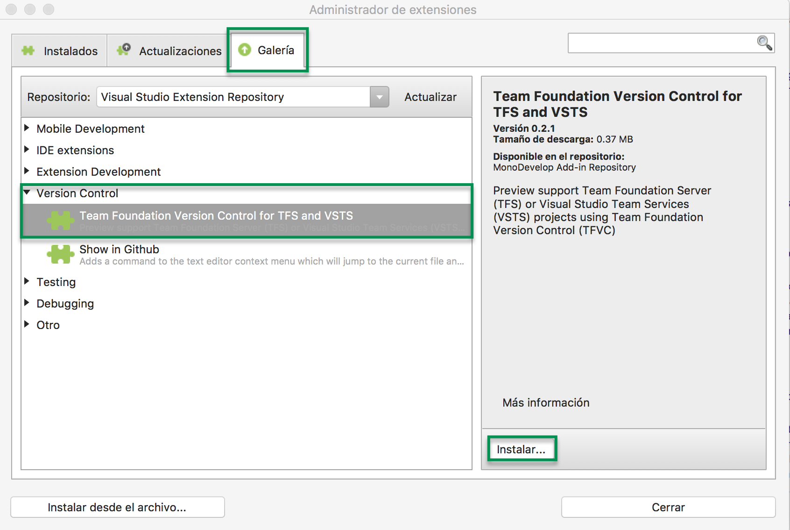

# 2.1.6 Consultar tus tareas pendientes

## 2.1.6.1 Consultar desde el navegador

Puedes ver la lista de tareas del proyecto en un kanboard  para el sprint actual. Puedes ver las tareas del proyecto en un Kanboard o en el Dashboard.

#### Ver las tareas del proyecto en Kanboard

1. Inicia sesión con tu cuenta en [Azure DevOps](https://visualstudio.microsoft.com/vso)
2. Selecciona tu proyecto
3. Da clic en **Work** y luego en **Board.** Si no se muestra da clic en **Expand** para ver las tareas del sprint actual. Puedes seleccionar la persona de la cual deseas restaltar sus tares

####  Ver las tareas en el Dahsboard

Azure Dev Ops cuenta con Widgets predefinidos para crear tus propios dashboard

Este dashboard es de otro proyecto. Por defecto tiene los siguientes Widgets:

* **Welcome:** Incluye los siguientes links para realizar las siguientes actividades:
  *  Agregar nuevas tareas.
  * Agregar el código a tu repositorio.
  * Una vez que tienes tu código, te permite automoatizar tus builds para publicarlo.
  * Consultar las gráficas de avance de las tareas.
* **Work Assigned to:** Indica las tareas asignadas a ti.
* **Team Members:** Te permite agregar mas personas al proyecto.
* **Sprint:** Te muestra el avance del sprint de forma gráfica.
* **New Work Item:** Te permite agregar una nueva tarea.
* **Work in Progress:** Te muestra el número de tareas que se estan realizando.
* **Visual Studio:** Te permite agregar el proyecto en Visual Studio o instalar Visual Studio.

Puedes personalizar y crear mas dashboards. Otra configuración puede ser la siguiente:

## 2.1.6.2 Consultar desde Visual Studio for Mac

Para conectar el Visual Studio for Mac a Azure Dev Ops necesitamos instalar la extensión

1. En el menu **Visual Studio Comunity** dar clic en **Extensiones...**
2. Seleccionar la pestaña **Galería**, seleccionar **Version Control** y luego **Team Foundation Version Control for TFS and VSTS**  y dar clic e**n Instalar.**

3. En el menu de Visual Studio dar clic en **Control de Versiones** seleccionar el menu T**FS / VSTS** -&gt; **Open for Remote Repository...**

4. Seleccionar la opción  **VSTS** 

**5.** Iniciar sesión con tu cuenta microsoft.

