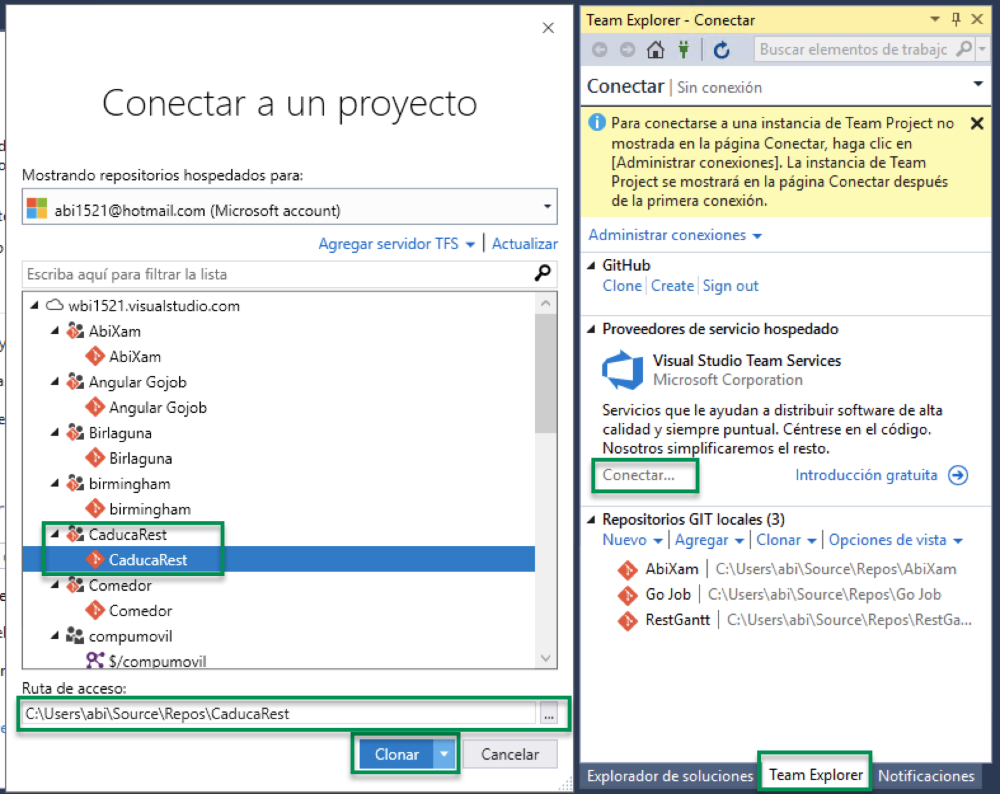
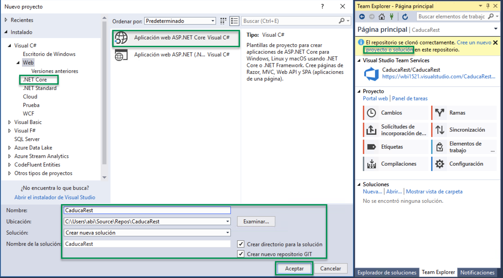
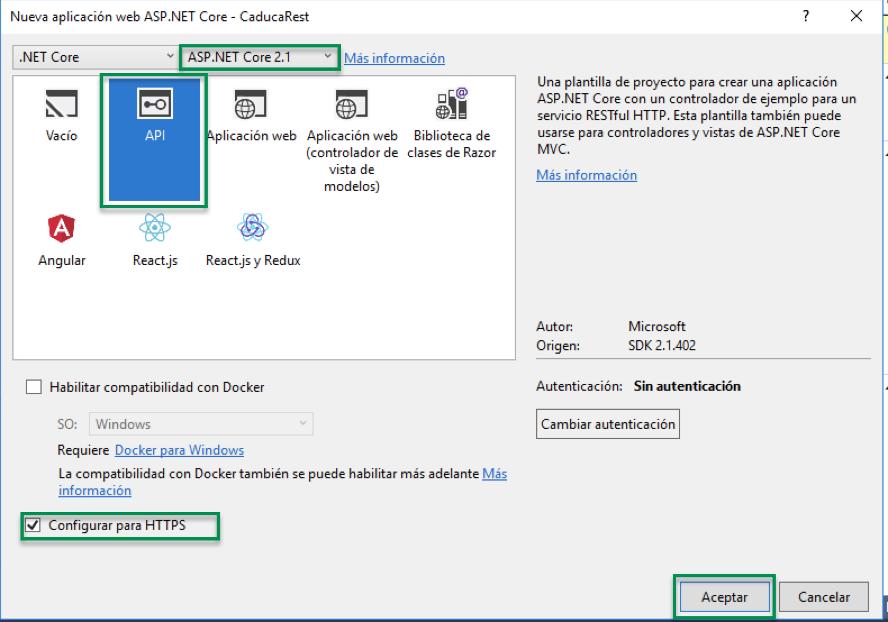
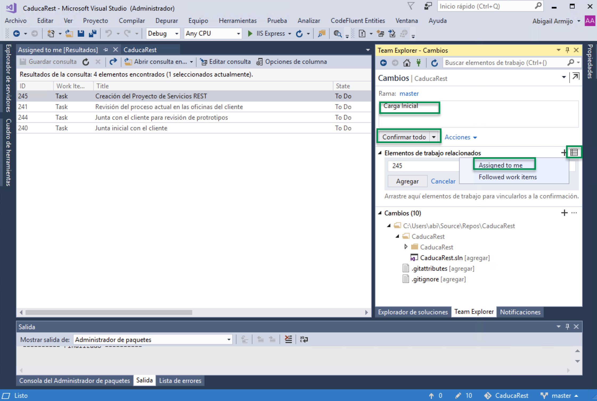
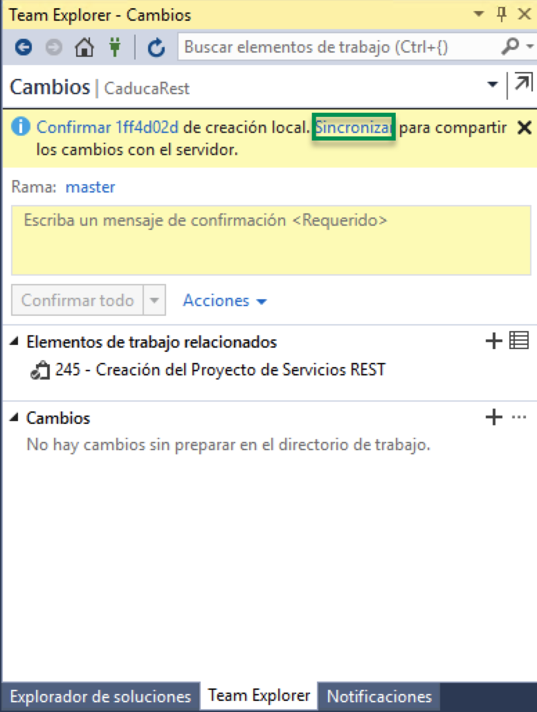

# 3.1.6.1 Crear tu proyecto con Visual Studio Community y sincronizarlo a Azure DevOps

1\. Abre Visual Studio y da clic en **Equipo -> Administrar Conexiones  **da clic en **Conectar**.. Inicia sesión con tu cuenta y conéctate al proyecto que **CaducaRest **en mi caso tengo varios proyectos con mi cuenta y dar clic en **Clonar**

2\. Ahora creamos un nuevo proyecto de .NET Core

3\. Seleccionas el tipo de Proyecto **API.** En este ejemplo no explicare como publicar la API en Docker por lo cual no seleccionare esa opción. Por seguridad se recomienda que los servicios cuenten con un certificado SSL, por default un proyecto de .NET Core 2.1 te permiten preparar tus servicios con un certificado SSL de prueba.

4\. Damos clic en **Cambios **para generar el primer commit al repositorio local de Git para luego subirlo a Visual Studio On Line. Debes teclear una descripción del cambio, puedes asociar el cambio a una tarea, para ver la lista de tareas puedes dar clic en el icono de lista y elegir las tareas que tú tienes asignadas. Tecleas el Id de la tarea y le das clic en **Confirmar todo. **

De esta forma has guardado los cambios a tu git de forma local, por lo cual solo en la computadora tienes el registro del cambio de código fuente.

5\. Da clic en **Sincronizar **para publicar el código en el servidor

Luego da Clic en Sincronizar para confirmar la publicación del cambio al servidor.&#x20;

Debido a que esta es la carga inicial no hay necesidad de Recuperar los cambios de los demás programadores. Se recomienda antes de hacer el commit recuperar los cambios de los demás programadores.
